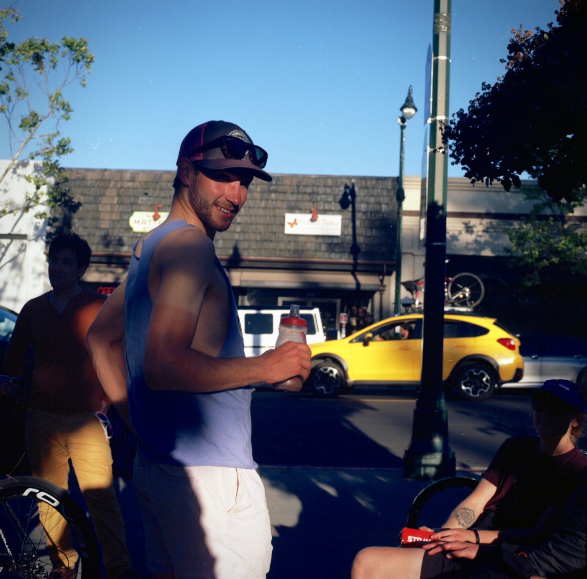

<html>
  <head>
    <link rel="shortcut icon" type="image/x-icon" href="favicon.ico">
  </head>
</html>

## Who

Hi there, I'm Cameron. I have a background in plant ecology and data science, and am interested in applications of software, remote sensing data and machine learning for ecosystem monitoring and climate mitigation.

## Work

I'm an intern at Planet, where I work on Analytics applications and infrastructure. At Planet, we're imaging Earth's entire land mass every day, and empowering our users to understand land use change at increasingly granular spatial and temporal resolutions. On Analytics, we build machine learning applications to enable organizations with varying levels of geospatial and ML expertise to understand complex dynamics of change at scales.

## Projects

Check out some of my data science work and GIS projects on [Github](https://github.com/cameronbronstein).

- [Crop classification in Kenya using Sentinel-2 imagery](https://github.com/cameronbronstein/iclr-radiant-crops)
- [Land cover classification in the Amazon with Planetscope](https://github.com/cameronbronstein/Planet-Amazon-Deep-Learning)
- [Mendecino Complex Fire - remote sensing indices and slider](https://cambostein.users.earthengine.app/view/mendocino-complex-fire)
- [CA wildfire time series visualizations](https://github.com/cameronbronstein/ca_wildfire_timeseries)

## Writing

It's the 21st century and I'm a millennial, so of course I have a blog. Really, this is a place where I write about new learnings in the realm of software, ML, ecology, and earth observation. Some day, it might take on new shapes and dimensions.

Here are some of thoughts my on the [Earth Observation industry](https://medium.com/@cambostein/reflections-on-ard19-ce9dddc7e64f) and [wildfire in California](https://medium.com/@cambostein/visualizing-the-mendocino-complex-fire-with-google-earth-engine-a5df0823e02c).

## Fun Facts

- My favorite plant is _Quercus agrifolia_, the California Coast Live Oak.

~[bike race](assets/glory_days.jpg)

- I am a Category 1 road cyclist (a life-long credential, I think). I used to have wicked tan lines and wanted to go Pro (I still ride for fun).

- I was [attacked by a river otter](https://www.wemjournal.org/article/S1080-6032(07)70202-8/fulltext) when I was 10.
- I used to work at [Chez Panisse](https://www.chezpanisse.com/about/chez-panisse/).

