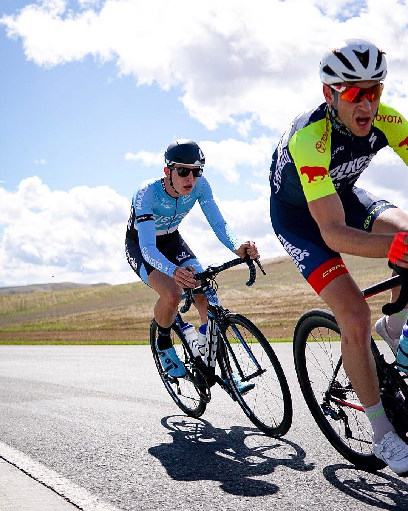
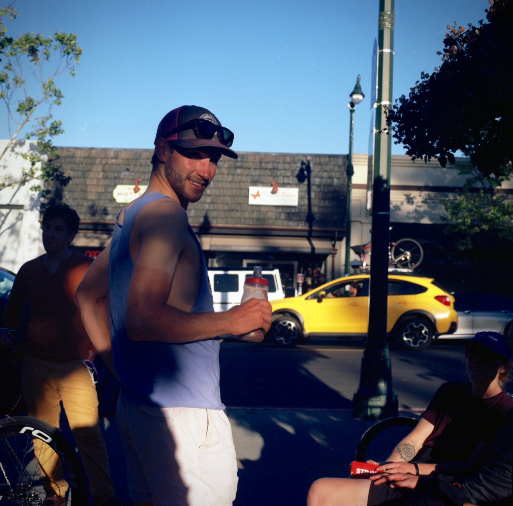
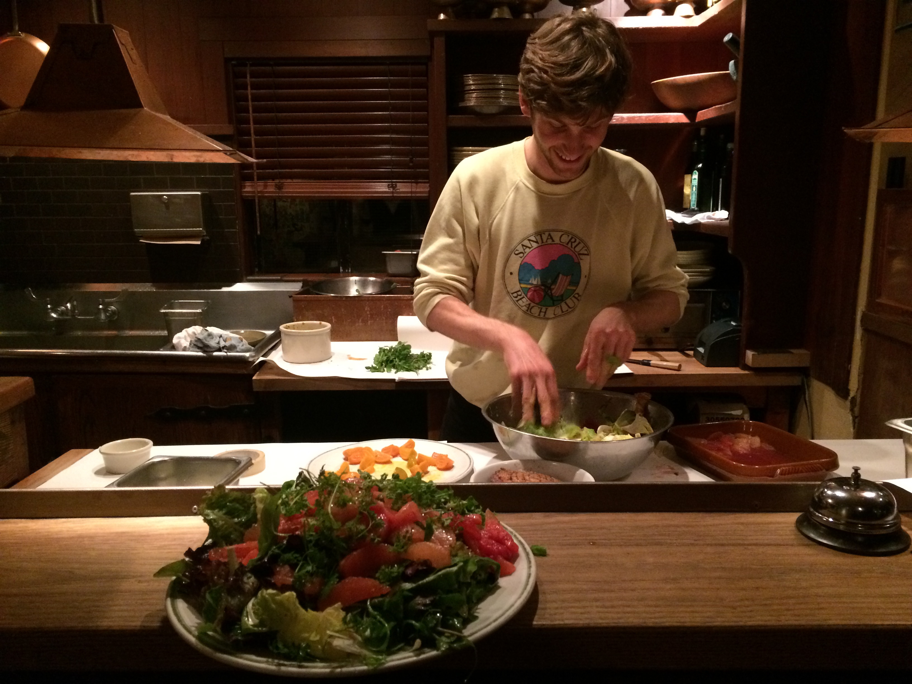

## Who
Hi there, I'm Cameron.

I have a background in plant ecology and data science, and am interested in applications of software, remote sensing data and machine learning for ecosystem monitoring and climate mitigation.

## Work
I'm a Software Engineer at [Planet](https://www.planet.com/) working on derived data products. At Planet, we're imaging Earth's entire land mass every day. Leveraging the high temporal and spatial resolution of our imagery data, we build machine learning models that give insight to complex dynamics of land cover change, and deploy these models on a global scale.

## Projects
Check out some of my data science work and GIS projects on [Github](https://github.com/cameronbronstein).

* [Crop classification in Kenya using Sentinel-2 imagery](https://github.com/cameronbronstein/iclr-radiant-crops)
* [Land cover classification in the Amazon with Planetscope](https://github.com/cameronbronstein/Planet-Amazon-Deep-Learning)
* [Mendecino Complex Fire - remote sensing indices and slider](https://cambostein.users.earthengine.app/view/mendocino-complex-fire)
* [CA wildfire time series visualizations](https://github.com/cameronbronstein/ca_wildfire_timeseries)

## Writing
Occasionally I blog about new learnings in the realm of software, ML, and earth observation. Some day, my writing might take on new shapes and dimensions. 

Here are some of thoughts my on the [Earth Observation industry](https://medium.com/@cambostein/reflections-on-ard19-ce9dddc7e64f) and [wildfire in California](https://medium.com/@cambostein/visualizing-the-mendocino-complex-fire-with-google-earth-engine-a5df0823e02c).

## Fun Facts
* My favorite plant is _Quercus agrifolia_, the California Coast Live Oak.

* I am a Category 1 road cyclist (a life-long credential, I think). I used to have wicked tan lines and wanted to go Pro. I still ride for fun.

  
  

* I was [attacked by a river otter](https://www.wemjournal.org/article/S1080-6032(07)70202-8/fulltext) when I was 10.
* I used to work at [Chez Panisse](https://www.chezpanisse.com/about/chez-panisse).

